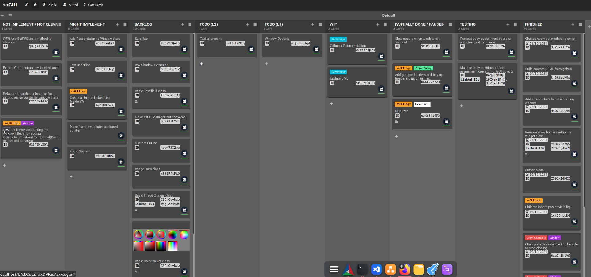

**Caution!!!!**

> Incomplete library. There are some core features missing. 


## What is ssGUI?


ssGUI stands for Super Simple GUI. The goal for this library is "Simple to Use, Simple to Customize, Simple to Extend".

This library can be used for both **graphical intensive** applications such as games or 2D/3D applications or **normal** day to day GUI applications.

Allowing user to build GUI with ease, customize it with Extension, extend it by creating custom Extension, Widget, Window 
and porting to other backends.

You can visit the amazing documentation [here](https://neko-box-coder.github.io/ssGUI/)

Currently, ssGUI only supports SFML but it is very easy to port to other backends. There's a dedicated documentation (WIP) for it. 
 
_

## What makes ssGUI special?


**Simple To Use.**


**Cross Platform. (Depends on Backend)**


**Awesome Documentations.**


**Customization With Extensions.**


**Source Compatible And ABI Compatible (Coming Soon).**


**GUI Code Is Independent From Backend.**


**Easy Swappable Backends.**


**Code Templates For Creating Widgets, Windows, Extensions And EventCallbacks (Coming Soon).**


**GUI Builder (Coming Soon).**

_

## How does it look
[TODO: Insert screenshots]

_

## Okay, what does it look like in code? (To be changed)


```C++
#include "ssGUI/DebugAndBuild/ssGUIDebugInit.hpp"                   //ssGUI debug initialization
#include "ssGUI/DebugAndBuild/ssGUIBuildAndDebugConfig.hpp"
#include "ssGUI/HeaderGroups/StandardGroup.hpp"                     //Includes all the core ssGUI classes
#include "ssGUI/Extensions/AdvancedPosition.hpp"

//Readme example
int main()
{
    //Create the main window
    ssGUI::MainWindow mainWindow;
    mainWindow.SetSize(glm::ivec2(450, 125));

    //AdvancedPosition extension allows more option to position a GUI Object. By default it will center the GUI object.
    ssGUI::Extensions::AdvancedPosition* positionExtension = new ssGUI::Extensions::AdvancedPosition();
    positionExtension->SetVerticalUsePercentage(false);

    //Create a text widget and set the respective properties
    ssGUI::Text text;
    text.SetText(L"Click on the button to show the message");
    text.SetHorizontalAlignment(ssGUI::Enums::TextAlignmentHorizontal::CENTER);
    text.SetVerticalAlignment(ssGUI::Enums::TextAlignmentVertical::BOTTOM);
    positionExtension->SetVerticalPixel(-30);
    text.AddExtension(positionExtension);
    
    //Create a button and set an event callback to change the text when it is clicked
    ssGUI::Button button;
    button.SetSize(glm::ivec2(50, 30));
    button.GetEventCallback(ssGUI::EventCallbacks::ButtonStateChangedEventCallback::EVENT_NAME)->AddEventListener
    (
        [&](ssGUI::GUIObject* src)
        {
            if(((ssGUI::Button*)src)->GetButtonState() == ssGUI::Enums::ButtonState::CLICKED)
            {
                text.SetText(L"(`oωo´)");
            }
        }
    );

    //Clone the extension for the button widget
    ssGUI::Extensions::AdvancedPosition* positionExtension2 = 
        static_cast<ssGUI::Extensions::AdvancedPosition*>(positionExtension->Clone(&button));
    positionExtension2->SetVerticalPixel(20);

    //Add the text and button widget to the main window
    text.SetParent(&mainWindow);
    button.SetParent(&mainWindow);

    //Create the GUIManager, add the main window and start running
    ssGUI::ssGUIManager guiManager;
    guiManager.AddGUIObject((ssGUI::GUIObject*)&mainWindow);
    guiManager.StartRunning();
    return 0;
}
```

_


## Licenses:
This project is under Apache-2.0 License.

GLM:
- The Happy Bunny License or MIT License

SFML:
- zlib/png license
- Components used by ssGUI:
    - freetype is under the FreeType license or the GPL license
    - stb_image and stb_image_write are public domain
- If you want to use other components, please visit https://github.com/SFML/SFML/blob/master/license.md for their licenses

_

## What's the progress status of the current library
 (Last Updated: 04/02/2022)