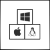
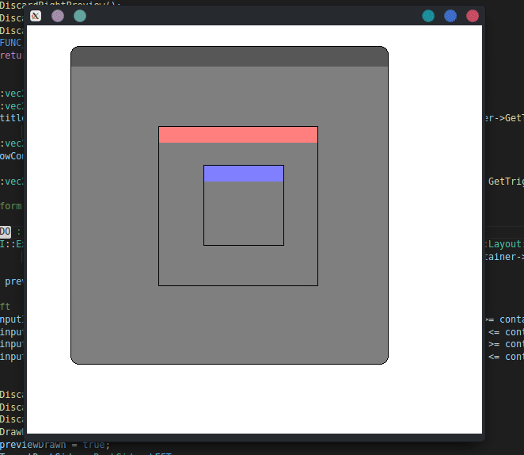
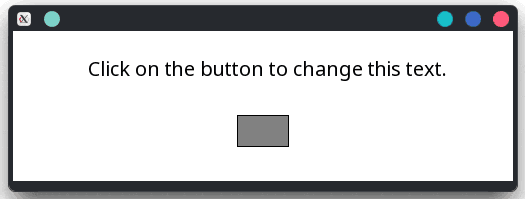

### Note
> This library is constantly changing until v1.00 . However, feel free to star or bookmark this project.

## What is ssGUI?


ssGUI stands for Super Simple GUI. The goal for this library is "Simple to Use, Simple to Customize, Simple to Extend".

This library can be used for both **graphical intensive** applications such as games or 2D/3D applications or **normal** day to day GUI applications.

Allowing user to build GUI with ease, customize it with Extension, extend it by creating custom Extension, Widget, Window 
and porting to other backends.

You can visit the amazing documentation [here](https://neko-box-coder.github.io/ssGUI/)

Currently, ssGUI only supports SFML but it is very easy to port to other backends. There's a dedicated documentation (WIP) for it. 
 
_

## What makes ssGUI special?


**Simple To Use.**


**Cross Platform. (Depends on Backend)**


**Awesome Documentations.**


**Customization With Extensions.**


**Source Compatible Compatible (WIP).**


**GUI Code Is Independent From Backend.**


**Easy Swappable Backends.**


**Code Templates For Creating Widgets, Windows, Extensions And EventCallbacks.**


**GUI Builder (WIP).**

_

## Cool Features

#### Layout:


#### Window Docking:


#### Mask:


#### And more to come...

_

## Okay, what does it look like in code?


```C++
#include "ssGUI/HeaderGroups/StandardGroup.hpp"
#include "ssGUI/DebugAndBuild/ssGUIBuildAndDebugConfig.hpp"

//Readme example
int main()
{
    //Create the main window
    ssGUI::MainWindow mainWindow;
    mainWindow.SetSize(glm::vec2(450, 125));
    mainWindow.SetResizeType(ssGUI::Enums::ResizeType::NONE);

    //Create a text widget and set the respective properties
    ssGUI::Text text;
    text.SetSize(glm::vec2(450, 60));
    text.SetText("Click on the button to change this text.");
    text.SetHorizontalAlignment(ssGUI::Enums::TextAlignmentHorizontal::CENTER);
    text.SetVerticalAlignment(ssGUI::Enums::TextAlignmentVertical::BOTTOM);

    //Create a button and set an event callback to change the text when it is clicked
    ssGUI::Button button;
    button.SetSize(glm::vec2(50, 30));
    button.SetPosition(glm::vec2(200, 75));
    button.GetEventCallback(ssGUI::EventCallbacks::ButtonStateChangedEventCallback::EVENT_NAME)->AddEventListener
    (
        [&](ssGUI::GUIObject* src, ssGUI::GUIObject* container, ssGUI::ObjectsReferences* refs)
        {
            if(((ssGUI::Button*)src)->GetButtonState() == ssGUI::Enums::ButtonState::CLICKED)
                text.SetText("Button pressed and this text has changed.");
        }
    );

    button.SetParent(&mainWindow);
    text.SetParent(&mainWindow);

    //Create the GUIManager, add the main window and start running
    ssGUI::ssGUIManager guiManager;
    guiManager.AddGUIObject((ssGUI::GUIObject*)&mainWindow);
    guiManager.StartRunning();
    return 0;
}
```

_


## Licenses:
This project is under Apache-2.0 License.

GLM:
- The Happy Bunny License or MIT License

SFML:
- zlib/png license
- Components used by ssGUI:
    - freetype is under the FreeType license or the GPL license
    - stb_image and stb_image_write are public domain
- If you want to use other components, please visit https://github.com/SFML/SFML/blob/master/license.md for their licenses

_

## What's the progress status of the current library
https://neko-box-coder.github.io/ssGUI/WekanBoard/ssGUI (Last Updated: 26/03/2022)