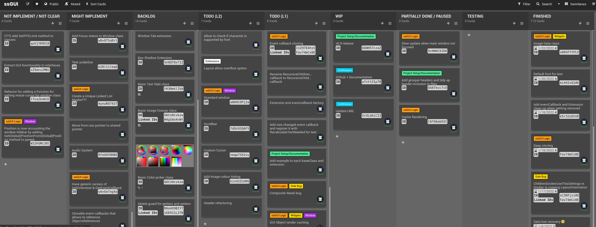

**Caution!!!!**

> WIP library. The current state of the library is not intended for public release/use yet.


## What is ssGUI?


ssGUI stands for Super Simple GUI. The goal for this library is "Simple to Use, Simple to Customize, Simple to Extend".

This library can be used for both **graphical intensive** applications such as games or 2D/3D applications or **normal** day to day GUI applications.

Allowing user to build GUI with ease, customize it with Extension, extend it by creating custom Extension, Widget, Window 
and porting to other backends.

You can visit the amazing documentation [here](https://neko-box-coder.github.io/ssGUI/)

Currently, ssGUI only supports SFML but it is very easy to port to other backends. There's a dedicated documentation [TODO] for it. 
 
_

### What makes ssGUI special?


**Simple To Use.**


**Cross Platform. (Depends on Backend)**


**Awesome Documentations.**


**Customization With Extensions.**


**Source Compatible And ABI Compatible (Coming Soon).**


**GUI Code Is Independent From Backend.**


**Easy Swappable Backends.**


**Code Templates For Creating Widgets, Windows, Extensions And EventCallbacks (Coming Soon).**


**GUI Builder (Coming Soon).**

_

### How does it look
[TODO: Insert screenshots]

_

### Okay, what does it look like in code? (To be changed)


```C++
#include <iostream>
#include "ssGUI/ssGUIManager.hpp"
#include "ssGUI/BaseClasses/Text.hpp"
#include "ssGUI/BaseClasses/Button.hpp"

int main()
{
    //Create the main window
    ssGUI::MainWindow mainWindow;
    mainWindow.SetResizeType(ssGUI::Enums::ResizeType::NONE);
    mainWindow.SetSize(glm::ivec2(500, 150));

    //Loading the font
    ssGUI::Font font;
    if(font.GetBackendFontInterface()->LoadFromPath("NotoSans-Regular.ttf"))
        std::cout<<"font loaded\n";

    //Create a text widget and set the respective properties
    ssGUI::Text text;
    text.SetPosition(glm::ivec2(75, 25));
    text.SetFont(&font);
    text.SetFontSize(20);
    text.SetText(L"Click on the button to change this text.");

    //Create a button and set an event callback to change the text when it is clicked
    ssGUI::Button button;
    button.SetSize(glm::ivec2(50, 30));
    button.SetPosition(glm::ivec2(225, 85));
    button.GetEventCallback(ssGUI::EventCallbacks::ButtonStateChangedEventCallback::EVENT_NAME)->AddEventListener
    (
        [&](ssGUI::GUIObject* src)
        {
            if(((ssGUI::Button*)src)->GetButtonState() == ssGUI::Enums::ButtonState::CLICKED)
            {
                text.SetText(L"Button pressed and this text has changed.");
            }
        }
    );

    //Add the text and button widget to the main window
    text.SetParentP(&mainWindow);
    button.SetParentP(&mainWindow);

    //Create the GUIManager, add the main window and start running
    ssGUI::ssGUIManager guiManager;
    guiManager.AddGUIObject((ssGUI::GUIObject*)&mainWindow);
    guiManager.StartRunning();
    return 0;
}
```

_

### What's the progress status of the current library
 (Last Updated: 08/11/2021)