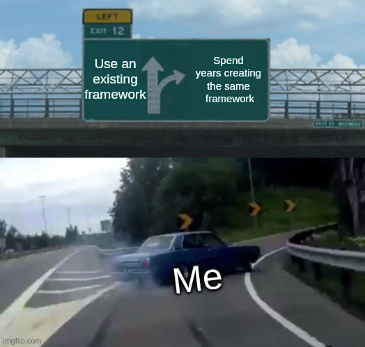

> ⚠️ This library is constantly changing & incomplete until v1.00 . However, feel free to star or bookmark this project.

<!-- ⚠️ Documentation is for the current stable version (v0.93.00.b), not for this version. Some info may not up-to-date.-->
### 🔌 Status of ssGUI (v0.94.01)
- #### 🔀 Branches
    <!--- -->
    - 
        <!--- -->
    <!--- -->
    - 
        - 
    - 

- #### 🖥️ OS support
    - 
    - -brightgreen?style=for-the-badge&logo=windows)
    - _-red?style=for-the-badge&logo=apple)

- #### 📈 Current Progress
    - 
    - 
    - 
---

### ❓ What is ssGUI?


- ### 🌍 Universal GUI Framework: 
    ssGUI is aimed to be an universal framework that can be used for both **graphical intensive** applications 🔥 and **normal** GUI applications 🎹.
    
    Only one GUI framework for games and normal GUI application with support to OpenGL window and (**WIP**) ~~native OS window~~.

- ### ✅ Cross Platform:
    ssGUI supports multiple platforms: Windows, Linux and (**WIP**) ~~MacOS~~.
    
    Nothing is restricted ⛔, you can get the underlying system handle easily if you want.

- ### 📖 Everything Is Documented
    ssGUI functions are verbose and easy to understand.
    
    HTML Documentation provides step by step tutorial for getting started, (**WIP**) ~~with a number of mock up GUI examples to reference from.~~ 
    
    API is clearly documented with (**WIP**) ~~images to describe each properties.~~

- ### 🦾 Easily Extensible
    ssGUI uses the extensions and (Optional) event callbacks model. Only add the functionalities you need and you are good to go.

- ### 📦 Everything You Need One Repo
    It by default uses native system libraries, no need to install any external packages or download binaries libraries.
    
    You can just build ssGUI from source using CMake.

- ### 🧩 Projects compatible
    ssGUI uses C++ 11 standard (With the exception for MSVC), which makes it compatible with many project within the last decade.

- ### 🔙 ~~Source Compatible~~ (WIP)
    ssGUI aims to be forward compatible in terms of souce compatibility, meaning no code change when migrating to newer ssGUI version. 
    
- ### 🏗️ ~~GUI Builder~~ (WIP)
    Easy visualization on what the GUI, no longer need to recompile everytime you make a change.
---

### ❓ Why Another GUI Framework?

1. Wanted to create an application with the performance of C++

<details>
  <summary>2. Realized there ain't any GUI framework I wanted at the time.</summary> 

- They are either:
    - Not fully open source license
    - Convoluted framework
    - Looks ugly
    - Missing modern features like docking or automatic layout
    - Terrible API
    - Steep learning curve

</details>

3. Decided to reinvent the wheel just like any other programmers

4. 2 years later, I still haven't created the application I wanted in the first place


 
Joke aside, I just wanted to have a GUI framework that can be: 
- Spined up within minutes with minimum / no configuration 
- Uses C++ STL 
- No restrictions on commercial use
- Simple, feature rich but not bloated

Which ssGUI has achieved most of them.


### 📌 Cool Features
#### Window Docking & Auto Layout:


#### Mask:


#### Text Alignment:


#### Text Character Level Customization:


#### Extension To Provide Modularity:


#### And more to come...

---

### GUI Objects List:
- ▶️ Button
- 🔲 Checkbox
- 📷 Image
- 🪟 MainWindow
- 📑 Menu
- 🈶 Text
- ✏️ TextField
- 📦 GUIObject, Widget & Window (Base GUI Objcet)
- 🗄️ Composite GUI Objects
    - 📄 Dropdown
    - 🩻 ImageCanvas
    - 🗃️ MenuItem
    - ↕️ Scrollbar
    - 🛝 Slider
    - ⏩ StandardButton
    - 🖥 StandardWindow

---

### 🧮 Quick Start

#### 🔧 Using ssGUI in your project
1. Add ssGUI to your project as submodule `git submodule add -b v0.94.01_release https://github.com/Neko-Box-Coder/ssGUI.git`
2. Then initialize the submodules used by ssGUI `git submodule init`
3. Add ssGUI to your `CMakeLists.txt` by doing `add_subdirectory("${CMAKE_CURRENT_LIST_DIR}/directory/to/ssGUI")`
4. And link it by doing `target_link_libraries(example PUBLIC ssGUI)`

#### 🏗️ Creating an simple GUI example
 
(You can find this at `ssGUI/Example/ReadmeExampleV7`)

```C++
#include "ssGUI/HeaderGroups/StandardGroup.hpp"
#include "ssGUI/Extensions/Layout.hpp"

//Readme example
using namespace ssGUI::Enums;
int main()
{
    ssGUI::MainWindow mainWindow;
    mainWindow.SetRenderSize(glm::vec2(450, 80));
    mainWindow.AddExtension<ssGUI::Extensions::Layout>();

    auto* text = mainWindow.AddChild<ssGUI::Text>();
    text->SetText("Click on the button to show the message");
    
    auto* button = mainWindow.AddChildWithWrapper<ssGUI::StandardButton>(AlignmentHorizontal::CENTER, AlignmentVertical::CENTER);
    button->SetSize(glm::vec2(50, 30));
                                                                                
    ssGUI::ssGUIManager guiManager;
    guiManager.AddRootGUIObject(&mainWindow);
    guiManager.AddPostGUIUpdateEventListener                                    
    (
        [&]()
        {
            if(button->GetButtonState() == ssGUI::Enums::ButtonState::CLICKED)
                text->SetText(L"(`oωo´)");
        }
    );
    guiManager.StartRunning();
    return 0;
}
```

---

### 🛣️ Roadmap
#### [Kanban Board](https://ssGUI.nekoboxcoder.dev/b/ckQsLZToXDPFzsAzx/ssgui)

#### Main Features that are on Roadmap:
- #### Mock up GUI examples
- #### MacOS support
- #### Support systems without OpenGL
- #### GUI Builder
- #### Optional immediate mode support
- File Diaglog support
- Tabs extension
- Color picker
- ~~Instance rendering~~
- etc...


---

### ❤️ Special Thanks

- #### SFML With Awesome Documentation:


- #### GLM With Great Math Structs And Math Functions: 


- #### Natural Docs With Amazing And Intuative Documentation Generation::

 

- #### stb_image for easy importing for different image formats
- #### freetype for easy  font importing
- #### clip for cross-platfrom clipboard implementation

---

### 📜 Licenses
This project is under Apache-2.0 License. 
Licenses for resoureces used by testing and examples are stored as "Credits.txt" under the same folder.

- GLM:
    - The Happy Bunny License or MIT License

- SFML:
    - zlib/png license
    - Components used by ssGUI:
        - freetype is under the FreeType license or the GPL license
        - stb_image and stb_image_write are public domain
    - If you want to use other components, please visit https://github.com/SFML/SFML/blob/master/license.md for their licenses
    
- stb_image:
    - MIT License or Public Domain
    
- freetype:
    - The FreeType License or GPLv2
    
- clip:
    - The clip license (Copyright (c) 2015-2022 David Capello)

