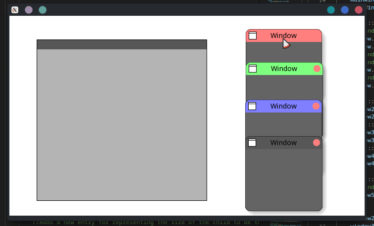

> ⚠️ This library is constantly changing & incomplete until v1.00 . However, feel free to star or bookmark this project.

<style>
li
{
    list-style-type: none;
}
</style>

### 🔌 Status of ssGUI
- #### 🔀 Branches
    - 
        - 
    - 
    - 

- #### 🖥️ OS support
    - 
    - 
    - 

- #### 📈 Current Progress
    <!-- #696969, #29D236-->
    - [![forthebadge](data:image/svg+xml;base64,PHN2ZyB4bWxucz0iaHR0cDovL3d3dy53My5vcmcvMjAwMC9zdmciIHdpZHRoPSIyNzMuNzIiIGhlaWdodD0iMzUiIHZpZXdCb3g9IjAgMCAyNzMuNzIgMzUiPjxyZWN0IGNsYXNzPSJzdmdfX3JlY3QiIHg9IjAiIHk9IjAiIHdpZHRoPSI3MC43MiIgaGVpZ2h0PSIzNSIgZmlsbD0iIzY5Njk2OSIvPjxyZWN0IGNsYXNzPSJzdmdfX3JlY3QiIHg9IjY4LjcyIiB5PSIwIiB3aWR0aD0iMjA1LjAwMDAwMDAwMDAwMDAzIiBoZWlnaHQ9IjM1IiBmaWxsPSIjMjlEMjM2Ii8+PHBhdGggY2xhc3M9InN2Z19fdGV4dCIgZD0iTTE2LjUxIDIyTDEzLjQ2IDEzLjQ3TDE1LjA4IDEzLjQ3TDE3LjIyIDIwLjE0TDE5LjM5IDEzLjQ3TDIxLjAyIDEzLjQ3TDE3Ljk1IDIyTDE2LjUxIDIyWk0yNC43MiAxOC41MUwyNC43MiAxOC41MUwyNC43MiAxNy4wM1EyNC43MiAxNS4xOSAyNS40MSAxNC4yN1EyNi4wOSAxMy4zNSAyNy41MSAxMy4zNUwyNy41MSAxMy4zNVEyOC45MSAxMy4zNSAyOS42MCAxNC4yNVEzMC4yOCAxNS4xNCAzMC4zMCAxNi45M0wzMC4zMCAxNi45M0wzMC4zMCAxOC40MVEzMC4zMCAyMC4yNSAyOS42MSAyMS4xOFEyOC45MiAyMi4xMiAyNy41MiAyMi4xMkwyNy41MiAyMi4xMlEyNi4xNCAyMi4xMiAyNS40MyAyMS4yMVEyNC43MyAyMC4yOSAyNC43MiAxOC41MVpNMjYuMTQgMTYuNjhMMjYuMTQgMTguNjFRMjYuMTQgMTkuODEgMjYuNDcgMjAuMzlRMjYuODAgMjAuOTggMjcuNTIgMjAuOThMMjcuNTIgMjAuOThRMjguMjAgMjAuOTggMjguNTMgMjAuNDRRMjguODYgMTkuOTAgMjguODggMTguNzRMMjguODggMTguNzRMMjguODggMTYuODFRMjguODggMTUuNjEgMjguNTUgMTUuMDVRMjguMjIgMTQuNDkgMjcuNTEgMTQuNDlMMjcuNTEgMTQuNDlRMjYuODEgMTQuNDkgMjYuNDggMTUuMDJRMjYuMTUgMTUuNTUgMjYuMTQgMTYuNjhMMjYuMTQgMTYuNjhaTTM0LjkyIDIxLjg1UTM0LjcwIDIxLjYzIDM0LjcwIDIxLjI5UTM0LjcwIDIwLjk1IDM0LjkyIDIwLjczUTM1LjE0IDIwLjUwIDM1LjUzIDIwLjUwTDM1LjUzIDIwLjUwUTM1LjkzIDIwLjUwIDM2LjE0IDIwLjczUTM2LjM2IDIwLjk1IDM2LjM2IDIxLjI5TDM2LjM2IDIxLjI5UTM2LjM2IDIxLjYzIDM2LjE0IDIxLjg0UTM1LjkzIDIyLjA2IDM1LjUzIDIyLjA2TDM1LjUzIDIyLjA2UTM1LjE1IDIyLjA2IDM0LjkyIDIxLjg1Wk00MC44MCAxNi4zM0w0MC44MCAxNi4zM1E0MC44MCAxNS40OCA0MS4xNCAxNC44MFE0MS40OCAxNC4xMSA0Mi4xMCAxMy43M1E0Mi43MyAxMy4zNSA0My41NiAxMy4zNUw0My41NiAxMy4zNVE0NC44NCAxMy4zNSA0NS42MCAxNC4zMVE0Ni4zNiAxNS4yNyA0Ni4zNiAxNi44OEw0Ni4zNiAxNi44OEw0Ni4zNiAxNy4yOFE0Ni4zNiAxOS41OSA0NS4zMSAyMC44MFE0NC4yNyAyMi4wMiA0Mi4yMCAyMi4wNEw0Mi4yMCAyMi4wNEw0Mi4wMyAyMi4wNEw0Mi4wMyAyMC44Nkw0Mi4yNCAyMC44NlE0My41MCAyMC44NCA0NC4xNyAyMC4yNVE0NC44NCAxOS42NiA0NC45MyAxOC40M0w0NC45MyAxOC40M1E0NC4yMSAxOS4xOSA0My4yNiAxOS4xOUw0My4yNiAxOS4xOVE0Mi4xMyAxOS4xOSA0MS40NiAxOC40MFE0MC44MCAxNy42MSA0MC44MCAxNi4zM1pNNDIuMjAgMTYuMjlMNDIuMjAgMTYuMjlRNDIuMjAgMTcuMDkgNDIuNTcgMTcuNThRNDIuOTQgMTguMDcgNDMuNTYgMTguMDdMNDMuNTYgMTguMDdRNDMuOTggMTguMDcgNDQuMzYgMTcuODNRNDQuNzMgMTcuNTggNDQuOTQgMTcuMTVMNDQuOTQgMTcuMTVMNDQuOTQgMTYuNTlRNDQuOTQgMTUuNjUgNDQuNTUgMTUuMDdRNDQuMTYgMTQuNTAgNDMuNTUgMTQuNTBRNDIuOTMgMTQuNTAgNDIuNTcgMTUuMDFRNDIuMjAgMTUuNTEgNDIuMjAgMTYuMjlaTTUwLjUyIDE5LjcxTDUwLjUyIDE5LjcxTDUxLjk1IDE5LjcxUTUxLjk1IDIwLjI4IDUyLjMyIDIwLjYzUTUyLjcwIDIwLjk4IDUzLjM0IDIwLjk4TDUzLjM0IDIwLjk4UTU0LjAwIDIwLjk4IDU0LjM4IDIwLjYzUTU0Ljc2IDIwLjI4IDU0Ljc2IDE5LjYxTDU0Ljc2IDE5LjYxUTU0Ljc2IDE4Ljk0IDU0LjM3IDE4LjU3UTUzLjk3IDE4LjIxIDUzLjE4IDE4LjIxTDUzLjE4IDE4LjIxTDUyLjM0IDE4LjIxTDUyLjM0IDE3LjA4TDUzLjIxIDE3LjA4UTUzLjg3IDE3LjA4IDU0LjI1IDE2Ljc0UTU0LjY0IDE2LjQxIDU0LjY0IDE1Ljc4TDU0LjY0IDE1Ljc4UTU0LjY0IDE1LjE3IDU0LjMyIDE0LjgzUTU0LjAwIDE0LjQ5IDUzLjM0IDE0LjQ5TDUzLjM0IDE0LjQ5UTUyLjc3IDE0LjQ5IDUyLjQwIDE0LjgzUTUyLjAzIDE1LjE2IDUyLjAzIDE1LjY5TDUyLjAzIDE1LjY5TDUwLjYwIDE1LjY5UTUwLjYwIDE1LjAzIDUwLjk1IDE0LjQ5UTUxLjMwIDEzLjk2IDUxLjkzIDEzLjY1UTUyLjU1IDEzLjM1IDUzLjMyIDEzLjM1TDUzLjMyIDEzLjM1UTU0LjYwIDEzLjM1IDU1LjMzIDEzLjk5UTU2LjA2IDE0LjYzIDU2LjA2IDE1Ljc4TDU2LjA2IDE1Ljc4UTU2LjA2IDE2LjM1IDU1LjY5IDE2Ljg2UTU1LjMzIDE3LjM3IDU0Ljc1IDE3LjYyTDU0Ljc1IDE3LjYyUTU1LjQ1IDE3Ljg2IDU1LjgyIDE4LjM4UTU2LjE4IDE4Ljg5IDU2LjE4IDE5LjYxTDU2LjE4IDE5LjYxUTU2LjE4IDIwLjc2IDU1LjM5IDIxLjQ0UTU0LjYxIDIyLjEyIDUzLjMyIDIyLjEyTDUzLjMyIDIyLjEyUTUyLjA5IDIyLjEyIDUxLjMxIDIxLjQ2UTUwLjUyIDIwLjgwIDUwLjUyIDE5LjcxWiIgZmlsbD0iI0ZGRkZGRiIvPjxwYXRoIGNsYXNzPSJzdmdfX3RleHQiIGQ9Ik04Ni41OCAyNC4zM0w4Mi45MSAyNC4zM0w4Mi45MSAxMy4wOUw4Ni41OCAxMy4wOUw4Ni41OCAxNC44M0w4NS4xOSAxNC44M0w4NS4xOSAyMi41OUw4Ni41OCAyMi41OUw4Ni41OCAyNC4zM1pNOTYuODMgMjAuMTlMOTAuOTIgMjAuMTlMOTAuOTIgMTguNDVMOTYuODMgMTguNDVMOTYuODMgMjAuMTlaTTk2LjgzIDE3LjE1TDkwLjkyIDE3LjE1TDkwLjkyIDE1LjQxTDk2LjgzIDE1LjQxTDk2LjgzIDE3LjE1Wk0xMDcuNjIgMjAuMTlMMTAxLjcxIDIwLjE5TDEwMS43MSAxOC40NUwxMDcuNjIgMTguNDVMMTA3LjYyIDIwLjE5Wk0xMDcuNjIgMTcuMTVMMTAxLjcxIDE3LjE1TDEwMS43MSAxNS40MUwxMDcuNjIgMTUuNDFMMTA3LjYyIDE3LjE1Wk0xMTguNDIgMjAuMTlMMTEyLjUwIDIwLjE5TDExMi41MCAxOC40NUwxMTguNDIgMTguNDVMMTE4LjQyIDIwLjE5Wk0xMTguNDIgMTcuMTVMMTEyLjUwIDE3LjE1TDExMi41MCAxNS40MUwxMTguNDIgMTUuNDFMMTE4LjQyIDE3LjE1Wk0xMjkuMjEgMjAuMTlMMTIzLjMwIDIwLjE5TDEyMy4zMCAxOC40NUwxMjkuMjEgMTguNDVMMTI5LjIxIDIwLjE5Wk0xMjkuMjEgMTcuMTVMMTIzLjMwIDE3LjE1TDEyMy4zMCAxNS40MUwxMjkuMjEgMTUuNDFMMTI5LjIxIDE3LjE1Wk0xNDAuMDAgMjAuMTlMMTM0LjA5IDIwLjE5TDEzNC4wOSAxOC40NUwxNDAuMDAgMTguNDVMMTQwLjAwIDIwLjE5Wk0xNDAuMDAgMTcuMTVMMTM0LjA5IDE3LjE1TDEzNC4wOSAxNS40MUwxNDAuMDAgMTUuNDFMMTQwLjAwIDE3LjE1Wk0xNTIuNzkgMTUuNDRMMTUxLjIzIDE1LjQ0TDE1MS4yMyAxMy42MEwxNTUuMTcgMTMuNjBMMTU1LjE3IDIyTDE1Mi43OSAyMkwxNTIuNzkgMTUuNDRaTTE1OS45MSAxNy44MEwxNTkuOTEgMTcuODBRMTU5LjkxIDE2LjQ1IDE2MC4zOCAxNS40NlExNjAuODYgMTQuNDYgMTYxLjcwIDEzLjk1UTE2Mi41NCAxMy40MyAxNjMuNjEgMTMuNDNMMTYzLjYxIDEzLjQzUTE2NC42OCAxMy40MyAxNjUuNTIgMTMuOTVRMTY2LjM2IDE0LjQ2IDE2Ni44NCAxNS40NlExNjcuMzEgMTYuNDUgMTY3LjMxIDE3LjgwTDE2Ny4zMSAxNy44MFExNjcuMzEgMTkuMTUgMTY2Ljg0IDIwLjE1UTE2Ni4zNiAyMS4xNCAxNjUuNTMgMjEuNjVRMTY0LjY5IDIyLjE3IDE2My42MSAyMi4xN0wxNjMuNjEgMjIuMTdRMTYyLjU0IDIyLjE3IDE2MS43MCAyMS42NVExNjAuODYgMjEuMTQgMTYwLjM4IDIwLjE1UTE1OS45MSAxOS4xNiAxNTkuOTEgMTcuODBaTTE2Mi4zMCAxNy44MEwxNjIuMzAgMTcuODBRMTYyLjMwIDE5LjA2IDE2Mi42NSAxOS42NFExNjMuMDEgMjAuMjIgMTYzLjYxIDIwLjIyTDE2My42MSAyMC4yMlExNjQuMjIgMjAuMjIgMTY0LjU3IDE5LjY0UTE2NC45MyAxOS4wNiAxNjQuOTMgMTcuODBMMTY0LjkzIDE3LjgwUTE2NC45MyAxNi41NCAxNjQuNTcgMTUuOTZRMTY0LjIyIDE1LjM4IDE2My42MSAxNS4zOEwxNjMuNjEgMTUuMzhRMTYzLjAxIDE1LjM4IDE2Mi42NSAxNS45NlExNjIuMzAgMTYuNTQgMTYyLjMwIDE3LjgwWk0xNzEuNjEgMTcuODBMMTcxLjYxIDE3LjgwUTE3MS42MSAxNi40NSAxNzIuMDggMTUuNDZRMTcyLjU2IDE0LjQ2IDE3My40MCAxMy45NVExNzQuMjQgMTMuNDMgMTc1LjMyIDEzLjQzTDE3NS4zMiAxMy40M1ExNzYuMzggMTMuNDMgMTc3LjIyIDEzLjk1UTE3OC4wNiAxNC40NiAxNzguNTQgMTUuNDZRMTc5LjAxIDE2LjQ1IDE3OS4wMSAxNy44MEwxNzkuMDEgMTcuODBRMTc5LjAxIDE5LjE1IDE3OC41NCAyMC4xNVExNzguMDYgMjEuMTQgMTc3LjIzIDIxLjY1UTE3Ni4zOSAyMi4xNyAxNzUuMzIgMjIuMTdMMTc1LjMyIDIyLjE3UTE3NC4yNCAyMi4xNyAxNzMuNDAgMjEuNjVRMTcyLjU2IDIxLjE0IDE3Mi4wOCAyMC4xNVExNzEuNjEgMTkuMTYgMTcxLjYxIDE3LjgwWk0xNzQuMDAgMTcuODBMMTc0LjAwIDE3LjgwUTE3NC4wMCAxOS4wNiAxNzQuMzUgMTkuNjRRMTc0LjcxIDIwLjIyIDE3NS4zMiAyMC4yMkwxNzUuMzIgMjAuMjJRMTc1LjkyIDIwLjIyIDE3Ni4yNyAxOS42NFExNzYuNjMgMTkuMDYgMTc2LjYzIDE3LjgwTDE3Ni42MyAxNy44MFExNzYuNjMgMTYuNTQgMTc2LjI3IDE1Ljk2UTE3NS45MiAxNS4zOCAxNzUuMzIgMTUuMzhMMTc1LjMyIDE1LjM4UTE3NC43MSAxNS4zOCAxNzQuMzUgMTUuOTZRMTc0LjAwIDE2LjU0IDE3NC4wMCAxNy44MFpNMTgzLjE3IDE1LjgyTDE4My4xNyAxNS44MlExODMuMTcgMTUuMTEgMTgzLjQ0IDE0LjU4UTE4My43MiAxNC4wNSAxODQuMjAgMTMuNzdRMTg0LjY5IDEzLjQ5IDE4NS4zMiAxMy40OUwxODUuMzIgMTMuNDlRMTg2LjI4IDEzLjQ5IDE4Ni44OCAxNC4xMlExODcuNDcgMTQuNzUgMTg3LjQ3IDE1LjgyTDE4Ny40NyAxNS44MlExODcuNDcgMTYuOTAgMTg2Ljg3IDE3LjUyUTE4Ni4yNyAxOC4xNSAxODUuMzIgMTguMTVMMTg1LjMyIDE4LjE1UTE4NC4zNyAxOC4xNSAxODMuNzcgMTcuNTNRMTgzLjE3IDE2LjkwIDE4My4xNyAxNS44MlpNMTg2LjI3IDIyTDE4NC41NSAyMkwxOTAuMjkgMTMuNjBMMTkyLjAxIDEzLjYwTDE4Ni4yNyAyMlpNMTg0LjYxIDE1LjgyTDE4NC42MSAxNS44MlExODQuNjEgMTYuNDIgMTg0LjgxIDE2LjcxUTE4NS4wMCAxNy4wMSAxODUuMzIgMTcuMDFMMTg1LjMyIDE3LjAxUTE4NS42NCAxNy4wMSAxODUuODMgMTYuNzJRMTg2LjAyIDE2LjQzIDE4Ni4wMiAxNS44MkwxODYuMDIgMTUuODJRMTg2LjAyIDE1LjIxIDE4NS44MyAxNC45MlExODUuNjQgMTQuNjMgMTg1LjMyIDE0LjYzTDE4NS4zMiAxNC42M1ExODUuMDEgMTQuNjMgMTg0LjgxIDE0LjkzUTE4NC42MSAxNS4yMiAxODQuNjEgMTUuODJaTTE4OS4xMCAxOS43OEwxODkuMTAgMTkuNzhRMTg5LjEwIDE4LjcxIDE4OS43MCAxOC4wOFExOTAuMzAgMTcuNDUgMTkxLjI0IDE3LjQ1TDE5MS4yNCAxNy40NVExOTIuMjAgMTcuNDUgMTkyLjgwIDE4LjA4UTE5My40MCAxOC43MSAxOTMuNDAgMTkuNzhMMTkzLjQwIDE5Ljc4UTE5My40MCAyMC44NiAxOTIuODAgMjEuNDhRMTkyLjIwIDIyLjExIDE5MS4yNCAyMi4xMUwxOTEuMjQgMjIuMTFRMTkwLjI5IDIyLjExIDE4OS42OSAyMS40OFExODkuMTAgMjAuODYgMTg5LjEwIDE5Ljc4Wk0xOTAuNTQgMTkuNzhMMTkwLjU0IDE5Ljc4UTE5MC41NCAyMC4zOSAxOTAuNzMgMjAuNjhRMTkwLjkyIDIwLjk3IDE5MS4yNCAyMC45N0wxOTEuMjQgMjAuOTdRMTkxLjU3IDIwLjk3IDE5MS43NiAyMC42OFExOTEuOTUgMjAuMzkgMTkxLjk1IDE5Ljc4TDE5MS45NSAxOS43OFExOTEuOTUgMTkuMTcgMTkxLjc2IDE4Ljg4UTE5MS41NyAxOC41OSAxOTEuMjQgMTguNTlMMTkxLjI0IDE4LjU5UTE5MC45MiAxOC41OSAxOTAuNzMgMTguODhRMTkwLjU0IDE5LjE3IDE5MC41NCAxOS43OFpNMjEwLjc0IDIwLjE5TDIwNC44MiAyMC4xOUwyMDQuODIgMTguNDVMMjEwLjc0IDE4LjQ1TDIxMC43NCAyMC4xOVpNMjEwLjc0IDE3LjE1TDIwNC44MiAxNy4xNUwyMDQuODIgMTUuNDFMMjEwLjc0IDE1LjQxTDIxMC43NCAxNy4xNVpNMjIxLjUzIDIwLjE5TDIxNS42MiAyMC4xOUwyMTUuNjIgMTguNDVMMjIxLjUzIDE4LjQ1TDIyMS41MyAyMC4xOVpNMjIxLjUzIDE3LjE1TDIxNS42MiAxNy4xNUwyMTUuNjIgMTUuNDFMMjIxLjUzIDE1LjQxTDIyMS41MyAxNy4xNVpNMjMyLjMyIDIwLjE5TDIyNi40MSAyMC4xOUwyMjYuNDEgMTguNDVMMjMyLjMyIDE4LjQ1TDIzMi4zMiAyMC4xOVpNMjMyLjMyIDE3LjE1TDIyNi40MSAxNy4xNUwyMjYuNDEgMTUuNDFMMjMyLjMyIDE1LjQxTDIzMi4zMiAxNy4xNVpNMjQzLjExIDIwLjE5TDIzNy4yMCAyMC4xOUwyMzcuMjAgMTguNDVMMjQzLjExIDE4LjQ1TDI0My4xMSAyMC4xOVpNMjQzLjExIDE3LjE1TDIzNy4yMCAxNy4xNUwyMzcuMjAgMTUuNDFMMjQzLjExIDE1LjQxTDI0My4xMSAxNy4xNVpNMjUzLjkxIDIwLjE5TDI0OC4wMCAyMC4xOUwyNDguMDAgMTguNDVMMjUzLjkxIDE4LjQ1TDI1My45MSAyMC4xOVpNMjUzLjkxIDE3LjE1TDI0OC4wMCAxNy4xNUwyNDguMDAgMTUuNDFMMjUzLjkxIDE1LjQxTDI1My45MSAxNy4xNVpNMjU4LjI0IDI0LjMzTDI1OC4yNCAyMi41OUwyNTkuNjMgMjIuNTlMMjU5LjYzIDE0LjgzTDI1OC4yNCAxNC44M0wyNTguMjQgMTMuMDlMMjYxLjkxIDEzLjA5TDI2MS45MSAyNC4zM0wyNTguMjQgMjQuMzNaIiBmaWxsPSIjRkZGRkZGIiB4PSI4MS43MiIvPjwvc3ZnPg==)](https://forthebadge.com)
    
    <!-- #696969, #E5FF3C, #74762A -->
    - [![forthebadge](data:image/svg+xml;base64,PHN2ZyB4bWxucz0iaHR0cDovL3d3dy53My5vcmcvMjAwMC9zdmciIHdpZHRoPSIyNzIuOSIgaGVpZ2h0PSIzNSIgdmlld0JveD0iMCAwIDI3Mi45IDM1Ij48cmVjdCBjbGFzcz0ic3ZnX19yZWN0IiB4PSIwIiB5PSIwIiB3aWR0aD0iNzEuMTEiIGhlaWdodD0iMzUiIGZpbGw9IiM2OTY5NjkiLz48cmVjdCBjbGFzcz0ic3ZnX19yZWN0IiB4PSI2OS4xMSIgeT0iMCIgd2lkdGg9IjIwMy43ODk5OTk5OTk5OTk5NiIgaGVpZ2h0PSIzNSIgZmlsbD0iI0U1RkYzQyIvPjxwYXRoIGNsYXNzPSJzdmdfX3RleHQiIGQ9Ik0xNi41MSAyMkwxMy40NiAxMy40N0wxNS4wOCAxMy40N0wxNy4yMiAyMC4xNEwxOS4zOSAxMy40N0wyMS4wMiAxMy40N0wxNy45NSAyMkwxNi41MSAyMlpNMjQuNzIgMTguNTFMMjQuNzIgMTguNTFMMjQuNzIgMTcuMDNRMjQuNzIgMTUuMTkgMjUuNDEgMTQuMjdRMjYuMDkgMTMuMzUgMjcuNTEgMTMuMzVMMjcuNTEgMTMuMzVRMjguOTEgMTMuMzUgMjkuNjAgMTQuMjVRMzAuMjggMTUuMTQgMzAuMzAgMTYuOTNMMzAuMzAgMTYuOTNMMzAuMzAgMTguNDFRMzAuMzAgMjAuMjUgMjkuNjEgMjEuMThRMjguOTIgMjIuMTIgMjcuNTIgMjIuMTJMMjcuNTIgMjIuMTJRMjYuMTQgMjIuMTIgMjUuNDMgMjEuMjFRMjQuNzMgMjAuMjkgMjQuNzIgMTguNTFaTTI2LjE0IDE2LjY4TDI2LjE0IDE4LjYxUTI2LjE0IDE5LjgxIDI2LjQ3IDIwLjM5UTI2LjgwIDIwLjk4IDI3LjUyIDIwLjk4TDI3LjUyIDIwLjk4UTI4LjIwIDIwLjk4IDI4LjUzIDIwLjQ0UTI4Ljg2IDE5LjkwIDI4Ljg4IDE4Ljc0TDI4Ljg4IDE4Ljc0TDI4Ljg4IDE2LjgxUTI4Ljg4IDE1LjYxIDI4LjU1IDE1LjA1UTI4LjIyIDE0LjQ5IDI3LjUxIDE0LjQ5TDI3LjUxIDE0LjQ5UTI2LjgxIDE0LjQ5IDI2LjQ4IDE1LjAyUTI2LjE1IDE1LjU1IDI2LjE0IDE2LjY4TDI2LjE0IDE2LjY4Wk0zNC45MiAyMS44NVEzNC43MCAyMS42MyAzNC43MCAyMS4yOVEzNC43MCAyMC45NSAzNC45MiAyMC43M1EzNS4xNCAyMC41MCAzNS41MyAyMC41MEwzNS41MyAyMC41MFEzNS45MyAyMC41MCAzNi4xNCAyMC43M1EzNi4zNiAyMC45NSAzNi4zNiAyMS4yOUwzNi4zNiAyMS4yOVEzNi4zNiAyMS42MyAzNi4xNCAyMS44NFEzNS45MyAyMi4wNiAzNS41MyAyMi4wNkwzNS41MyAyMi4wNlEzNS4xNSAyMi4wNiAzNC45MiAyMS44NVpNNDAuODAgMTYuMzNMNDAuODAgMTYuMzNRNDAuODAgMTUuNDggNDEuMTQgMTQuODBRNDEuNDggMTQuMTEgNDIuMTAgMTMuNzNRNDIuNzMgMTMuMzUgNDMuNTYgMTMuMzVMNDMuNTYgMTMuMzVRNDQuODQgMTMuMzUgNDUuNjAgMTQuMzFRNDYuMzYgMTUuMjcgNDYuMzYgMTYuODhMNDYuMzYgMTYuODhMNDYuMzYgMTcuMjhRNDYuMzYgMTkuNTkgNDUuMzEgMjAuODBRNDQuMjcgMjIuMDIgNDIuMjAgMjIuMDRMNDIuMjAgMjIuMDRMNDIuMDMgMjIuMDRMNDIuMDMgMjAuODZMNDIuMjQgMjAuODZRNDMuNTAgMjAuODQgNDQuMTcgMjAuMjVRNDQuODQgMTkuNjYgNDQuOTMgMTguNDNMNDQuOTMgMTguNDNRNDQuMjEgMTkuMTkgNDMuMjYgMTkuMTlMNDMuMjYgMTkuMTlRNDIuMTMgMTkuMTkgNDEuNDYgMTguNDBRNDAuODAgMTcuNjEgNDAuODAgMTYuMzNaTTQyLjIwIDE2LjI5TDQyLjIwIDE2LjI5UTQyLjIwIDE3LjA5IDQyLjU3IDE3LjU4UTQyLjk0IDE4LjA3IDQzLjU2IDE4LjA3TDQzLjU2IDE4LjA3UTQzLjk4IDE4LjA3IDQ0LjM2IDE3LjgzUTQ0LjczIDE3LjU4IDQ0Ljk0IDE3LjE1TDQ0Ljk0IDE3LjE1TDQ0Ljk0IDE2LjU5UTQ0Ljk0IDE1LjY1IDQ0LjU1IDE1LjA3UTQ0LjE2IDE0LjUwIDQzLjU1IDE0LjUwUTQyLjkzIDE0LjUwIDQyLjU3IDE1LjAxUTQyLjIwIDE1LjUxIDQyLjIwIDE2LjI5Wk01MC40MCAyMC4xMEw1MC4zNiAxOS4yM0w1NC4wNCAxMy40N0w1NS41MSAxMy40N0w1NS41MSAxOC45Nkw1Ni41NyAxOC45Nkw1Ni41NyAyMC4xMEw1NS41MSAyMC4xMEw1NS41MSAyMkw1NC4wOSAyMkw1NC4wOSAyMC4xMEw1MC40MCAyMC4xMFpNNTMuOTggMTUuNThMNTEuODYgMTguOTZMNTQuMDkgMTguOTZMNTQuMDkgMTUuNDBMNTMuOTggMTUuNThaIiBmaWxsPSIjRkZGRkZGIi8+PHBhdGggY2xhc3M9InN2Z19fdGV4dCIgZD0iTTg2Ljk3IDI0LjMzTDgzLjMwIDI0LjMzTDgzLjMwIDEzLjA5TDg2Ljk3IDEzLjA5TDg2Ljk3IDE0LjgzTDg1LjU4IDE0LjgzTDg1LjU4IDIyLjU5TDg2Ljk3IDIyLjU5TDg2Ljk3IDI0LjMzWk05Ny4yMiAyMC4xOUw5MS4zMSAyMC4xOUw5MS4zMSAxOC40NUw5Ny4yMiAxOC40NUw5Ny4yMiAyMC4xOVpNOTcuMjIgMTcuMTVMOTEuMzEgMTcuMTVMOTEuMzEgMTUuNDFMOTcuMjIgMTUuNDFMOTcuMjIgMTcuMTVaTTEwOC4wMSAyMC4xOUwxMDIuMTAgMjAuMTlMMTAyLjEwIDE4LjQ1TDEwOC4wMSAxOC40NUwxMDguMDEgMjAuMTlaTTEwOC4wMSAxNy4xNUwxMDIuMTAgMTcuMTVMMTAyLjEwIDE1LjQxTDEwOC4wMSAxNS40MUwxMDguMDEgMTcuMTVaTTExOC44MSAyMC4xOUwxMTIuODkgMjAuMTlMMTEyLjg5IDE4LjQ1TDExOC44MSAxOC40NUwxMTguODEgMjAuMTlaTTExOC44MSAxNy4xNUwxMTIuODkgMTcuMTVMMTEyLjg5IDE1LjQxTDExOC44MSAxNS40MUwxMTguODEgMTcuMTVaTTE1Ny44MSAyMS4zNEwxNTcuODEgMjEuMzRMMTU4LjY3IDE5LjU1UTE1OS4xNiAxOS44OCAxNTkuNzggMjAuMDdRMTYwLjQwIDIwLjI1IDE2MS4wMCAyMC4yNUwxNjEuMDAgMjAuMjVRMTYxLjYxIDIwLjI1IDE2MS45NyAyMC4wMlExNjIuMzMgMTkuNzkgMTYyLjMzIDE5LjM3TDE2Mi4zMyAxOS4zN1ExNjIuMzMgMTguNTUgMTYxLjA1IDE4LjU1TDE2MS4wNSAxOC41NUwxNjAuMDUgMTguNTVMMTYwLjA1IDE3LjA1TDE2MS41NSAxNS40NEwxNTguMjQgMTUuNDRMMTU4LjI0IDEzLjYwTDE2NC4zMSAxMy42MEwxNjQuMzEgMTUuMDlMMTYyLjU3IDE2Ljk2UTE2My42MSAxNy4xOCAxNjQuMTcgMTcuODJRMTY0LjczIDE4LjQ2IDE2NC43MyAxOS4zN0wxNjQuNzMgMTkuMzdRMTY0LjczIDIwLjExIDE2NC4zMyAyMC43NVExNjMuOTIgMjEuMzkgMTYzLjEwIDIxLjc4UTE2Mi4yOCAyMi4xNyAxNjEuMDcgMjIuMTdMMTYxLjA3IDIyLjE3UTE2MC4xOCAyMi4xNyAxNTkuMzEgMjEuOTVRMTU4LjQ0IDIxLjc0IDE1Ny44MSAyMS4zNFpNMTY4Ljk4IDE3LjgwTDE2OC45OCAxNy44MFExNjguOTggMTYuNDUgMTY5LjQ1IDE1LjQ2UTE2OS45MiAxNC40NiAxNzAuNzYgMTMuOTVRMTcxLjYwIDEzLjQzIDE3Mi42OCAxMy40M0wxNzIuNjggMTMuNDNRMTczLjc1IDEzLjQzIDE3NC41OSAxMy45NVExNzUuNDMgMTQuNDYgMTc1LjkxIDE1LjQ2UTE3Ni4zOCAxNi40NSAxNzYuMzggMTcuODBMMTc2LjM4IDE3LjgwUTE3Ni4zOCAxOS4xNSAxNzUuOTEgMjAuMTVRMTc1LjQzIDIxLjE0IDE3NC41OSAyMS42NVExNzMuNzUgMjIuMTcgMTcyLjY4IDIyLjE3TDE3Mi42OCAyMi4xN1ExNzEuNjAgMjIuMTcgMTcwLjc2IDIxLjY1UTE2OS45MiAyMS4xNCAxNjkuNDUgMjAuMTVRMTY4Ljk4IDE5LjE2IDE2OC45OCAxNy44MFpNMTcxLjM2IDE3LjgwTDE3MS4zNiAxNy44MFExNzEuMzYgMTkuMDYgMTcxLjcyIDE5LjY0UTE3Mi4wNyAyMC4yMiAxNzIuNjggMjAuMjJMMTcyLjY4IDIwLjIyUTE3My4yOSAyMC4yMiAxNzMuNjQgMTkuNjRRMTc0LjAwIDE5LjA2IDE3NC4wMCAxNy44MEwxNzQuMDAgMTcuODBRMTc0LjAwIDE2LjU0IDE3My42NCAxNS45NlExNzMuMjkgMTUuMzggMTcyLjY4IDE1LjM4TDE3Mi42OCAxNS4zOFExNzIuMDcgMTUuMzggMTcxLjcyIDE1Ljk2UTE3MS4zNiAxNi41NCAxNzEuMzYgMTcuODBaTTE4MC41MyAxNS44MkwxODAuNTMgMTUuODJRMTgwLjUzIDE1LjExIDE4MC44MSAxNC41OFExODEuMDkgMTQuMDUgMTgxLjU3IDEzLjc3UTE4Mi4wNiAxMy40OSAxODIuNjggMTMuNDlMMTgyLjY4IDEzLjQ5UTE4My42NSAxMy40OSAxODQuMjQgMTQuMTJRMTg0Ljg0IDE0Ljc1IDE4NC44NCAxNS44MkwxODQuODQgMTUuODJRMTg0Ljg0IDE2LjkwIDE4NC4yNCAxNy41MlExODMuNjQgMTguMTUgMTgyLjY4IDE4LjE1TDE4Mi42OCAxOC4xNVExODEuNzQgMTguMTUgMTgxLjEzIDE3LjUzUTE4MC41MyAxNi45MCAxODAuNTMgMTUuODJaTTE4My42NCAyMkwxODEuOTIgMjJMMTg3LjY1IDEzLjYwTDE4OS4zOCAxMy42MEwxODMuNjQgMjJaTTE4MS45OCAxNS44MkwxODEuOTggMTUuODJRMTgxLjk4IDE2LjQyIDE4Mi4xNyAxNi43MVExODIuMzcgMTcuMDEgMTgyLjY4IDE3LjAxTDE4Mi42OCAxNy4wMVExODMuMDEgMTcuMDEgMTgzLjIwIDE2LjcyUTE4My4zOSAxNi40MyAxODMuMzkgMTUuODJMMTgzLjM5IDE1LjgyUTE4My4zOSAxNS4yMSAxODMuMjAgMTQuOTJRMTgzLjAxIDE0LjYzIDE4Mi42OCAxNC42M0wxODIuNjggMTQuNjNRMTgyLjM3IDE0LjYzIDE4Mi4xNyAxNC45M1ExODEuOTggMTUuMjIgMTgxLjk4IDE1LjgyWk0xODYuNDYgMTkuNzhMMTg2LjQ2IDE5Ljc4UTE4Ni40NiAxOC43MSAxODcuMDYgMTguMDhRMTg3LjY3IDE3LjQ1IDE4OC42MSAxNy40NUwxODguNjEgMTcuNDVRMTg5LjU3IDE3LjQ1IDE5MC4xNyAxOC4wOFExOTAuNzcgMTguNzEgMTkwLjc3IDE5Ljc4TDE5MC43NyAxOS43OFExOTAuNzcgMjAuODYgMTkwLjE3IDIxLjQ4UTE4OS41NyAyMi4xMSAxODguNjEgMjIuMTFMMTg4LjYxIDIyLjExUTE4Ny42NSAyMi4xMSAxODcuMDYgMjEuNDhRMTg2LjQ2IDIwLjg2IDE4Ni40NiAxOS43OFpNMTg3LjkxIDE5Ljc4TDE4Ny45MSAxOS43OFExODcuOTEgMjAuMzkgMTg4LjEwIDIwLjY4UTE4OC4yOSAyMC45NyAxODguNjEgMjAuOTdMMTg4LjYxIDIwLjk3UTE4OC45NCAyMC45NyAxODkuMTMgMjAuNjhRMTg5LjMyIDIwLjM5IDE4OS4zMiAxOS43OEwxODkuMzIgMTkuNzhRMTg5LjMyIDE5LjE3IDE4OS4xMyAxOC44OFExODguOTQgMTguNTkgMTg4LjYxIDE4LjU5TDE4OC42MSAxOC41OVExODguMjkgMTguNTkgMTg4LjEwIDE4Ljg4UTE4Ny45MSAxOS4xNyAxODcuOTEgMTkuNzhaTTI1Ny40MiAyNC4zM0wyNTcuNDIgMjIuNTlMMjU4LjgxIDIyLjU5TDI1OC44MSAxNC44M0wyNTcuNDIgMTQuODNMMjU3LjQyIDEzLjA5TDI2MS4wOSAxMy4wOUwyNjEuMDkgMjQuMzNMMjU3LjQyIDI0LjMzWiIgZmlsbD0iIzc0NzYyQSIgeD0iODIuMTEiLz48L3N2Zz4=)](https://forthebadge.com)

---

### ❓ What is ssGUI?


ssGUI stands for Super Simple GUI. The goal for this library is "Simple to Use, Simple to Customize, Simple to Extend".

This is a verbose library 💬, meaning you have high flexibility on changing different aspects of the GUI objects.

But that doesn't mean you need to go and set every value, most of the default values should work out of the box 📤.

This library can be used for both *graphical intensive* applications 🔥 such as games or 2D/3D applications or *normal* day to day GUI applications 🎹.

Allowing user to build GUI with ease, and the ability to customize it with `ssGUI::Extensions::Extension`.

You can visit the amazing documentation [here](https://neko-box-coder.github.io/ssGUI/)

Currently, ssGUI only supports SFML but it is architectured to also be compatible with other backends. More backend will be added in the future. 

---

### ✨ What makes ssGUI special?


**Simple To Use**


**Cross Platform (Depends on Backend)**


**Awesome Documentations**


**Customization With Extensions**


**Source Compatible (WIP)**


**GUI Code Is Independent From Backend**


**Decopuled Backend Architecture**


**Code Templates For Creating Your Own Widgets, Windows, Extensions And EventCallbacks**


**GUI Builder (WIP)**

---

### 📌 Cool Features
#### Window Docking & Auto Layout:


#### Mask:


#### Text Alignment:


#### Text Character Level Customization:


#### Extension To Provide Modularity:


#### And more to come...

---

### GUI Objects List:
- ▶️ Button
- 🔲 Checkbox
- 📷 Image
- 🪟 MainWindow
- 📑 Menu
- 🈶 Text
- ✏️ TextField
- 📦 GUIObject, Widget & Window (Base GUI Objcet)
- 🗄️ Composite GUI Objects
    - 📄 Dropdown
    - 🩻 ImageCanvas
    - 🗃️ MenuItem
    - ↕️ Scrollbar
    - 🛝 Slider
    - ⏩ StandardButton
    - 🖥 StandardWindow

---

### 🧮 Okay, what does it look like in code?
 
```C++
#include "ssGUI/HeaderGroups/StandardGroup.hpp"

//Readme example
int main()
{
    //Create the main window
    ssGUI::MainWindow mainWindow;
    mainWindow.SetSize(glm::vec2(450, 110));
    mainWindow.SetResizeType(ssGUI::Enums::ResizeType::NONE);

    //Create a text widget and set the respective properties
    ssGUI::Text text;
    text.SetSize(glm::vec2(450, 45));
    text.SetNewCharacterFontSize(17);
    text.SetText("Click on the button to show the message");
    text.SetHorizontalAlignment(ssGUI::Enums::TextAlignmentHorizontal::CENTER);
    text.SetVerticalAlignment(ssGUI::Enums::TextAlignmentVertical::BOTTOM);

    //Create a button
    ssGUI::StandardButton button;
    button.SetSize(glm::vec2(40, 30));
    button.SetPosition(glm::vec2(205, 60));

    //Set the parents
    button.SetParent(&mainWindow);
    text.SetParent(&mainWindow);

    //Create the GUIManager, add the main window and start running
    ssGUI::ssGUIManager guiManager;
    guiManager.AddGUIObject((ssGUI::GUIObject*)&mainWindow);
    guiManager.AddPostGUIUpdateEventListener
    (
        [&]()
        {
            if(button.GetButtonState() == ssGUI::Enums::ButtonState::CLICKED)
                text.SetText(L"(`oωo´)");
        }
    );
    guiManager.StartRunning();
    return 0;
}
```

---

### 🛣️ [Roadmap](https://ssGUI.nekoboxcoder.dev/b/ckQsLZToXDPFzsAzx/ssgui)


---

### ❤️ Special Thanks

#### SFML With Awesome Documentation:


#### GLM With Great Math Structs And Math Functions: 


#### Natural Docs With Amazing And Intuative Documentation Generation::

 

---

### 📜 Licenses
This project is under Apache-2.0 License. 
Licenses for resoureces used by testing and examples are stored as "Credits.txt" under the same folder.

GLM:
- The Happy Bunny License or MIT License

SFML:
- zlib/png license
- Components used by ssGUI:
    - freetype is under the FreeType license or the GPL license
    - stb_image and stb_image_write are public domain
- If you want to use other components, please visit https://github.com/SFML/SFML/blob/master/license.md for their licenses


